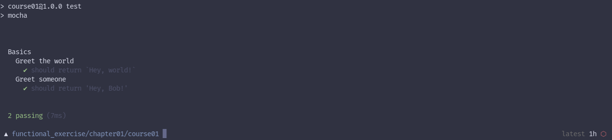

# Chapter 1

JS Basics
---

Subject(s) : JS Basics

Level : Beginners

Goal(s) :
- Know how nodejs arranges your files.
- Create and use JS function.
- Create and use variables.

## Course 1

The goal of this course it to understand the basics of JS.

You will learn how to create a simple function and how to use variables.

Your workspace will be a simple folder with a file called `index.js` and inside of it you must define a function called `greetWorld` that return the text 'Hey, world!'.

Before you start to code, you need to install Node.js on you computer, you can do this by going to the [Node.js website](https://nodejs.org/en/).

And then you can run:

```
npm install
```

This will install all dependencies of the project. You'll need to run this command before getting into each course of this program.

Try it yourself and see if you can get it to work.

To know what you have done is correct, you can run the command `npm test` in the terminal.
That will tell you what works and what doesn't.

Here what you'll get :


As you can see, the first test is passing, but not the second one.

The second function `greet` give you a variable that tell the name of a people to greet.
Try to greet him/her with your own code and run the test again.

If it work, congratulations! You've got something like this on the console that tell you that everything work !



If not, you must have something to change in your code.

**Optional**:
Ok, so now you can make the previous function better,
You just have to capitilize the name. To be sure that people name display correctly even if they mistyped something.

Ok so, You've finished the first course. Congratulation!

Previous course | | [Next course](../course02/)
